# claude-mv

**Rename or move a project folder without orphaning its Claude Code history.**

Claude Code keys a project's history on its working directory. Rename the
folder and all of it stays behind on the old path — the
`~/.claude/projects/<encoded-cwd>/` session dir, the entry in the `projects`
map of `~/.claude.json`, and the prompt entries in `history.jsonl`. Open
`claude --resume` in the renamed folder and it reports no conversations,
while the real ones sit under a directory name that no longer corresponds to
anywhere on disk.

`claude-mv` does the `mv` **and** re-keys the history to match.

<p align="center">
  
</p>

(The text is genuine output — `tools/generate-readme-svg.zsh` seeds a sandbox
$HOME with a Claude profile, runs `claude-mv` against it, and converts the ANSI
colours to SVG. Only the window and the `%` prompt line are drawn. Every store
it touched is reported, and the run closes with the tally. The *pacing* is the
one invented part: the lines are real, the speed they arrive at is a reveal,
not a recording — a single captured run carries no timing. It plays once and
rests on the finished screen, and `prefers-reduced-motion` skips straight to
it.)

## Install

```sh
git clone https://github.com/deviationist/claude-mv.git ~/.zsh/claude-mv
echo 'source ~/.zsh/claude-mv/claude-mv.zsh' >> ~/.zshrc
```

Requires `python3` (stdlib only) and zsh. Optional per-machine config:
`cp .env.example .env`.

## Usage

```
claude-mv [-n|--dry-run] [--force] [--already-moved] [--on-conflict MODE] <src-dir> <dst>
claude-mv --extract [--no-browse] [--session ID]... [--limit N] [<src-dir>] [<dst>]
claude-mv --restore [<stamp>|latest]
```

| Flag | What it does |
|---|---|
| `-n`, `--dry-run` | print the full migration plan, change nothing |
| `--force` | proceed despite a live Claude session in the affected path |
| `--already-moved` | the folder was renamed by something else — move nothing, just re-key the history stranded on the old path |
| `--extract` | move individual *sessions* out of `src`'s history onto `dst`, rather than moving a folder |
| `--no-browse` | with `--extract`: don't browse for the folders, take both as arguments (then both are required) |
| `--session ID` | which session to move (repeatable); skips the session picker. An 8-character prefix is enough |
| `--limit N` | how many sessions the picker offers (default 50) |
| `--on-conflict MODE` | policy when the destination already has history: `overwrite`, `consolidate`, `rename-only`, `abort` (with `--extract`: `overwrite`, `skip`, `abort`) |
| `--restore [stamp]` | list restore points, or roll one back |

`src` and `dst` follow `mv` semantics — if `dst` is an existing directory the
folder lands *inside* it. `~`, relative paths and trailing slashes all work.

### Already renamed it by hand?

The common case: you renamed the folder in an editor, kept working, and only
then noticed the history didn't follow.

```sh
claude-mv --already-moved ~/code/old-name ~/code/new-name
```

Nothing is moved; only the history is re-keyed. The old path can't be
recovered from the encoded directory name (the encoding is lossy), so it has
to be given explicitly. Sessions started in the renamed folder before you
reconcile are normal — that's a conflict, and `consolidate` keeps both sides.

### The project that was born mid-session

You were in `~/code`, had an idea, and told Claude to make a folder and `cd`
into it. The project is real now — but its whole conversation is still keyed
on `~/code`, because that is where the session *started*. `claude --resume`
in the new folder finds nothing.

`--already-moved` is the wrong tool here: it would drag **all** of `~/code`'s
history along, and most of those sessions genuinely belong to `~/code`. You
want the one session (or a few) that don't.

Stand in the folder the sessions came from and run it with no arguments at
all:

```sh
cd ~/code
claude-mv --extract
```

It walks you through three steps, in the order you actually decide them:

1. **Which folder holds the sessions** — starts on the current directory, and
   each row shows how many sessions that directory has, so you can see where
   the history really is instead of guessing.
2. **Which sessions** — listed newest first with the opening line of each
   conversation. Pick one or several.
3. **Where they should go** — the destination is the one thing this mode
   never infers.

Any path you do pass *seeds* a step rather than skipping it, so
`claude-mv --extract ~/code/couchsurfing-image-recovery` opens the last
prompt already on that folder and Enter accepts it. A lone argument is always
the destination, since the source defaults to the current directory and the
destination has no default at all.

<p align="center">
  
</p>

**Scripting it.** `--no-browse` drops the two folder prompts and takes the
paths as arguments; add `--session` to skip the session picker as well, which
together make the run fully unattended:

```sh
claude-mv --extract --no-browse --session 3a43f4bb \
          ~/code ~/code/couchsurfing-image-recovery
```

Three things worth knowing, because all three are deliberate:

- **The destination is never guessed.** Not from the cwd, not from the source,
  not from the session. It is either an argument or something you picked. The
  source has a default because getting it wrong is visible — the session list
  comes up empty or wrong — while a wrong destination silently re-homes a
  conversation somewhere you'll have to go looking for it.

- **A session is found by where it was born, not where it ended up.** The
  session above spent most of its life inside the new folder, but it is
  listed under `~/code` — which is exactly right, since that is the project
  dir its transcript lives in and the reason resume can't see it.
- **The transcript is not rewritten.** No folder moved, so the `cwd` lines
  stay as they are: the session really did start in `~/code`. Resume works
  regardless — it keys on which project dir the transcript sits in.

### More than one profile, or a project nested inside

Each configured profile is migrated in turn, and a project *inside* the moved
folder that has sessions of its own — a monorepo subdir you have run Claude in
— follows along. Neither needs a flag; the same command just has more to
carry, and says so:

<p align="center">
  
</p>

Which profiles those are is [configurable](#configuration); by default it is
`~/.claude`, plus `~/.claude-personal` when it exists.

## Conflicts

If the destination already hosted Claude sessions, all conflicts are detected
**up front, before the `mv`**, and resolved by one policy — asked
interactively on a tty, or supplied with `--on-conflict`:

| Mode | Result |
|---|---|
| `overwrite` | destination history replaced; the discarded copy survives in the kept restore point |
| `consolidate` | merge — session files combined, config entries field-merged (booleans OR'd, `allowedTools` unioned, counters maxed, empty fields filled from the source) |
| `rename-only` | do the plain `mv`, leave all Claude history untouched |
| `abort` | do nothing at all |

<p align="center">
  
</p>

Because conflicts are resolved before the move, `abort` really does mean
nothing happened.

## Safety

- **Restore points.** Every path about to be touched is copied into
  `~/.claude-mv/restore/<stamp>/` with a manifest *before* any migration.
  Deleted on success; kept after an `overwrite` (as the archive of the
  discarded history) and kept on any mid-migration failure, with the error
  naming it. `claude-mv --restore <stamp>` rolls everything back, folder move
  included.
- **Live-session guard.** Refuses to move a folder with a running Claude
  session inside it (found via `<profile>/sessions/*.json` + pid liveness).
  Under `--extract` the same guard asks a sharper question — is *this
  session* running — since the folder isn't going anywhere and what matters
  is whether the transcript being relocated is still being written to.
  `--force` overrides.
- **Ambiguity is refused, not guessed** — a `--session` prefix matching two
  sessions is an error listing both, never a coin flip about whose history
  moves. `--limit` shortens the picker and nothing else: a session named
  outright is always found.
- **Nested projects follow.** A monorepo subdir with its own sessions is
  migrated too.
- **Ambiguity is never guessed.** The cwd encoding replaces every
  non-alphanumeric character with `-`, so `foo/bar`, `foo.bar` and `foo-bar`
  all collapse to the same string. A nested directory is only re-keyed when a
  session file inside it confirms a real cwd under the moved path — an
  unrelated sibling that merely *encodes* like one is left alone.
- **Paths are canonicalized the way Claude records them.** `~`, relative
  paths and trailing slashes are resolved, and so are symlinked ancestors —
  Claude stores the physical cwd the kernel reports, so `/tmp/x` on macOS is
  recorded as `/private/tmp/x`. The last path component is deliberately *not*
  resolved: if `src` is itself a symlink, `mv` renames the link and the real
  folder never moves, so its history must stay put.
- **No silent no-ops.** If nothing is keyed on `src`, it says so instead of
  printing a green "done" over a move that migrated nothing.

`overwrite` is the one mode that *keeps* its restore point on success — it is
the archive of the history it discarded, and so the only mode that leaves a
point to roll back to. End to end, that is: the move, the listing, the undo.
Nothing moves until the plan has been previewed and confirmed.

<p align="center">
  
</p>

## What gets migrated

Moving a **folder**:

| Store | Form | Handling |
|---|---|---|
| `<profile>/projects/<encoded-cwd>/` | directory name | renamed (or merged) |
| session `*.jsonl` → `cwd` | absolute path | rewritten; lines that don't change stay byte-identical |
| `~/.claude.json` → `projects` keys | absolute path | re-keyed (or field-merged) |
| `<profile>/history.jsonl` → `project` | absolute path | rewritten |

Moving **sessions** (`--extract`) is a different operation, not a narrower
one — most of the table changes:

| Store | Handling |
|---|---|
| `projects/<encoded-cwd>/<id>.jsonl` | relocated into the destination's project dir; the source dir stays, with its other sessions |
| `projects/<encoded-cwd>/<id>/` | relocated too — subagent transcripts and tool results |
| session `*.jsonl` → `cwd` | **not touched** |
| `~/.claude.json` → `projects` | **not touched** |
| `history.jsonl` → `project` | rewritten for that session's entries only, selected by `sessionId` |

Everything else under a profile (`todos/`, `file-history/`,
`shell-snapshots/`, `session-env/`, `plans/`, `tasks/`) is keyed by session
id, not path, so it needs no migration either way. The `<id>/` sidecar is the
exception that has to be carried by hand: it is session-keyed but lives
*inside* the project dir.

Why the two non-actions under `--extract`:

- **`cwd` is left alone** because nothing moved on disk. The session really
  did start in the parent directory, and rewriting the record to say
  otherwise would be a lie of exactly the kind the tool already declines to
  tell about paths in message content. It would also corrupt the common case:
  the destination is normally *inside* the source, so a prefix rewrite would
  hit the lines already naming the destination a second time.
- **The config entry is not created** because the source project still exists
  and still needs its own, and copying it across would transplant that
  project's trust flag and `allowedTools` onto a path you never approved.
  Claude writes a fresh entry the first time you run it there.

Paths embedded in *message content* — tool arguments, shell commands, file
contents — are deliberately left alone. The transcript is a record of what
actually happened, so old sessions still reference where the folder used to
be. Resume works; only the narrative points at the old path.

## Configuration

All optional — see [`.env.example`](.env.example).

| Variable | Default |
|---|---|
| `CLAUDE_PROFILE_DIRS` | asks [claude-profile](https://github.com/deviationist/claude-profile) when installed, else `~/.claude` plus `~/.claude-personal` when it exists |
| `CLAUDE_MV_OVERWRITE_BACKUP` | `1` — keep the restore point after an overwrite |
| `CLAUDE_MV_RESTORE_ROOT` | `~/.claude-mv/restore` |
| `CLAUDE_MV_CCFIND_SCRIPT` | where `ccfind.zsh` lives, if it is neither loaded nor a sibling clone |
| `CLAUDE_MV_SOURCE` | `auto` — which source lists sessions (`ccfind`, `fs`, `auto`) |
| `CLAUDE_MV_PICKER` | `auto` — which picker chooses them (`fzf`, `plain`, `auto`) |

### Optional helpers for `--extract`

Two soft dependencies, both used only by `--extract`, neither required —
`claude-mv` is still stdlib Python plus zsh without them.

**[ccfind](https://github.com/deviationist/ccfind)** lists the candidate
sessions (`ccfind --json -l -x -d <src>`) and brings full-text search across
transcript bodies. It is found the same three ways claude-profile is, with one
wrinkle: ccfind is a zsh *function*, so there is usually no file on `PATH` to
run — the wrapper traces it back to its defining script through
`$functions_source` and hands that down. Without ccfind the same list is read
straight off disk, still across every configured profile; what you lose is the
search, not the coverage.

`claude-mv` uses ccfind's answer only when it answered the same question it was
asked: the `scope_exact` flag in the JSON envelope has to come back `true`.
A ccfind that accepted `-x` and ignored it would be reporting on the whole
*subtree* — for `~/code` that is every sub-repo's sessions — so anything else
falls back to the filesystem. Setting `CLAUDE_MV_SOURCE=ccfind` turns that
fallback into an error instead, which is what you want when you meant to use
it.

**fzf** gives the picker multi-select and a search-as-you-type field. Without
it you get a numbered list and one prompt (`1`, `1,3`, `2-4`, `all`).

### Which profiles get migrated

Unset, `CLAUDE_PROFILE_DIRS` is resolved in this order:

1. **[claude-profile](https://github.com/deviationist/claude-profile), if
   installed** — where that juggler is present it is the machine's registry of
   Claude config dirs, so a profile added there is migrated here with no second
   edit. `claude-mv` has no dependency on it: it is found the same three ways
   `claude-usage` looks (`$CLAUDE_PROFILE_SCRIPT`, then a function or binary on
   `PATH`, then a sibling clone next to this repo), it is asked with the
   side-effect-free `list` porcelain, and any failure falls through silently.
2. **`~/.claude`**, plus **`~/.claude-personal`** when it exists.

Setting `CLAUDE_PROFILE_DIRS` in `.env` pins the list and skips both — which
also means a profile it omits is not migrated, and that history stays keyed on
the old path without a word about it. Prefer leaving it unset.

Output is coloured when stdout is a terminal and plain when it is piped.
`NO_COLOR` turns it off; `CLAUDE_MV_COLOR=always|never` overrides both. Colour
is a pure overlay — the text is identical either way.

## Assets

The README images are regenerated by:

```sh
zsh tools/generate-readme-svg.zsh   # → assets/{move,profiles,conflict,restore}-<hash>.svg + README refs
```

It builds a hermetic sandbox — a throwaway `$HOME` holding a folder to move and
seeded Claude profiles (`projects/`, session jsonl, config json,
`history.jsonl`), re-seeded per scenario — and runs the tool unmodified against it
with `CLAUDE_MV_COLOR=always`. Nothing outside that tmpdir is read or written.
The sandbox's tmpdir paths are rewritten to `/Users/demo` for display, in both
their plain and Claude-encoded forms; the answered prompts have their keystroke
and line break put back, since a piped stdin is never echoed. Rerun it whenever
the migration report, the conflict prompt, the session picker or the restore
screen changes; commit the SVGs together with the README, whose `` refs it
rewrites (the hash in the filename busts GitHub's image cache).

Each image then plays as a small terminal session: the command **types itself**
a character at a time with a block cursor walking after it, a beat for the
Enter, then its output arrives line by line. Scenes with more than one command
— the restore screen runs three — interleave, so you watch each one type, run,
and print before the next begins. It holds on the finished screen, then replays.

That is plain CSS `@keyframes`, one per character and per line, on a shared
cycle. GitHub serves a README image through ``, which runs stylesheets and
blocks scripts, so CSS is the only mechanism that survives the trip. `step-end`
rather than a fade, because a terminal prints a character, it does not dissolve
one into being.

**It loops because it has to.** A browser does not pause a CSS animation inside
an offscreen ``: an image below the fold has already finished by the time
you scroll to it. Playing once would mean four of these five never animate for
anyone who didn't land at the top. Starting on scroll isn't available either —
that needs script, which `` doesn't run — so the cycle is kept to 7–9s
instead, which bounds how long you wait after scrolling to one.

`prefers-reduced-motion: reduce` shows the whole thing, permanently. So does a
renderer that ignores the stylesheet, since the resting state of every element
is simply visible.

## Tests

```sh
python3 tests/test_claude_mv.py              # hermetic, ~1s
CLAUDE_MV_LIVE_TEST=1 python3 tests/test_claude_mv.py   # + live layers, ~20s
```

Nine layers, each closing a gap the previous ones can't see:

1. **Unit** — the pure helpers (encoding, canonicalization, config merging),
   the reporting layer (when colour is on, that it changes nothing but the
   escapes, what the tally says, which policy an answer selects), and how a
   picker selection parses. On the decisions, never on the escape codes.
2. **End-to-end** — a throwaway profile in a tmpdir, claude-mv run as a real
   subprocess, assertions on the resulting disk state.
3. **Multi-profile** — several profiles in one run, in the two config layouts
   a real machine mixes (`~/.claude.json` for the default profile, an
   in-dir `.claude.json` for the rest). Layer 2 passes exactly one
   `--profile`, so it cannot see a second one being skipped.
4. **Session sources** — every way ccfind can be unusable (wrong scope,
   missing handshake, a profile we were never given, a hit whose cwd isn't
   ours, broken, absent) must land on the filesystem walk rather than on a
   wrong list. Plus **the cross-check**: the *real* ccfind and the walk run
   over one fixture and must return identical sessions. That last one is what
   keeps a soft dependency honest — a source that disagrees makes the tool
   behave differently per machine, and no per-source test can see it. It needs
   a ccfind checkout, so it skips on CI; treat it as a local guard.
5. **Session move** — what moves and, just as much, what doesn't: siblings
   stay, the sidecar follows, the transcript is byte-identical afterwards, the
   config map is untouched, only that session's history entries are re-keyed.
   Plus the picker, driven over a pipe, and with a stub standing in for fzf.
6. **Wrapper** — `claude-mv.zsh` decides *which* profiles the python is told
   about and *where* ccfind is; the layers above bypass both by passing them
   in. Covers `.env` pin / claude-profile / built-in default, and ccfind as a
   loaded function, an override, a sibling clone, or absent.
7. **Conformance** — read-only checks that the *real* `~/.claude` still
   matches the format the fixtures imitate: the cwd encoding, `sessionId` on
   history entries (without which `--extract` can't tell one session's
   prompts from another's), the `<id>/` sidecar layout, and that transcripts
   are still written compactly. Without this, a Claude Code format change
   would leave every other test green while the tool broke.
8. **Live** — drives the real `claude` binary and uses it as the oracle for
   its own cwd encoding: Claude writes a project dir, claude-mv migrates it,
   Claude runs again at the new path and must land in the same directory
   rather than creating a second one.
9. **Resume UI** — runs `claude --resume` under tmux at the moved path and
   reads the picker off the screen, with a plain-`mv` negative control that
   must come up empty.

Layers 8 and 9 are opt-in via `CLAUDE_MV_LIVE_TEST=1`. Neither needs
authentication or spends any tokens: Claude Code writes its project files
before it checks credentials, and the resume picker reads sessions straight
off disk.

## License

MIT
