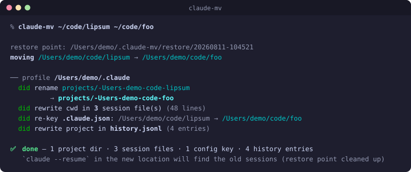
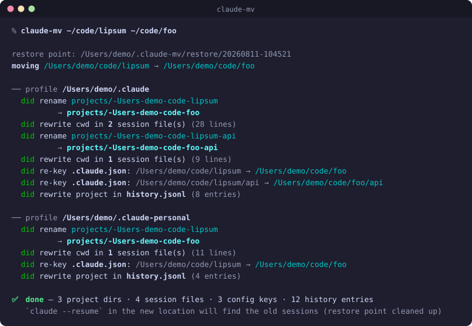
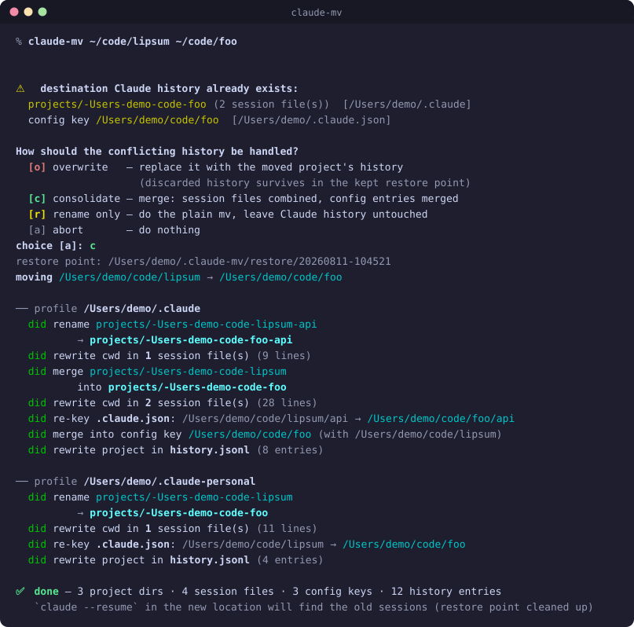
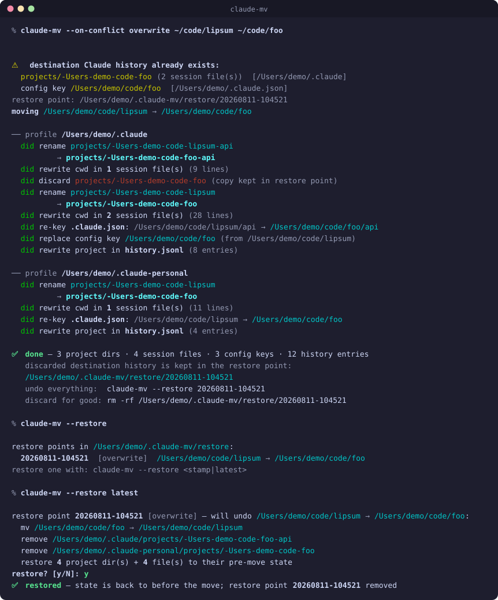

# claude-mv

**Rename or move a project folder without orphaning its Claude Code history.**

Claude Code keys a project's history on its working directory. Rename the
folder and all of it stays behind on the old path — the
`~/.claude/projects/<encoded-cwd>/` session dir, the entry in the `projects`
map of `~/.claude.json`, and the prompt entries in `history.jsonl`. Open
`claude --resume` in the renamed folder and it reports no conversations,
while the real ones sit under a directory name that no longer corresponds to
anywhere on disk.

`claude-mv` does the `mv` **and** re-keys the history to match.

<p align="center">
  
</p>

(The image is genuine output — `tools/generate-readme-svg.zsh` seeds a sandbox
$HOME with a Claude profile, runs `claude-mv` against it, and converts the ANSI
colours to SVG. Only the window and the `%` prompt line are drawn. Every store
it touched is reported, and the run closes with the tally.)

## Install

```sh
git clone https://github.com/deviationist/claude-mv.git ~/.zsh/claude-mv
echo 'source ~/.zsh/claude-mv/claude-mv.zsh' >> ~/.zshrc
```

Requires `python3` (stdlib only) and zsh. Optional per-machine config:
`cp .env.example .env`.

## Usage

```
claude-mv [-n|--dry-run] [--force] [--already-moved] [--on-conflict MODE] <src-dir> <dst>
claude-mv --restore [<stamp>|latest]
```

| Flag | What it does |
|---|---|
| `-n`, `--dry-run` | print the full migration plan, change nothing |
| `--force` | proceed despite a live Claude session in the affected path |
| `--already-moved` | the folder was renamed by something else — move nothing, just re-key the history stranded on the old path |
| `--on-conflict MODE` | policy when the destination already has history: `overwrite`, `consolidate`, `rename-only`, `abort` |
| `--restore [stamp]` | list restore points, or roll one back |

`src` and `dst` follow `mv` semantics — if `dst` is an existing directory the
folder lands *inside* it. `~`, relative paths and trailing slashes all work.

### Already renamed it by hand?

The common case: you renamed the folder in an editor, kept working, and only
then noticed the history didn't follow.

```sh
claude-mv --already-moved ~/code/old-name ~/code/new-name
```

Nothing is moved; only the history is re-keyed. The old path can't be
recovered from the encoded directory name (the encoding is lossy), so it has
to be given explicitly. Sessions started in the renamed folder before you
reconcile are normal — that's a conflict, and `consolidate` keeps both sides.

### More than one profile, or a project nested inside

Each configured profile is migrated in turn, and a project *inside* the moved
folder that has sessions of its own — a monorepo subdir you have run Claude in
— follows along. Neither needs a flag; the same command just has more to
carry, and says so:

<p align="center">
  
</p>

Which profiles those are is [configurable](#configuration); by default it is
`~/.claude`, plus `~/.claude-personal` when it exists.

## Conflicts

If the destination already hosted Claude sessions, all conflicts are detected
**up front, before the `mv`**, and resolved by one policy — asked
interactively on a tty, or supplied with `--on-conflict`:

| Mode | Result |
|---|---|
| `overwrite` | destination history replaced; the discarded copy survives in the kept restore point |
| `consolidate` | merge — session files combined, config entries field-merged (booleans OR'd, `allowedTools` unioned, counters maxed, empty fields filled from the source) |
| `rename-only` | do the plain `mv`, leave all Claude history untouched |
| `abort` | do nothing at all |

<p align="center">
  
</p>

Because conflicts are resolved before the move, `abort` really does mean
nothing happened.

## Safety

- **Restore points.** Every path about to be touched is copied into
  `~/.claude-mv/restore/<stamp>/` with a manifest *before* any migration.
  Deleted on success; kept after an `overwrite` (as the archive of the
  discarded history) and kept on any mid-migration failure, with the error
  naming it. `claude-mv --restore <stamp>` rolls everything back, folder move
  included.
- **Live-session guard.** Refuses to move a folder with a running Claude
  session inside it (found via `<profile>/sessions/*.json` + pid liveness).
  `--force` overrides.
- **Nested projects follow.** A monorepo subdir with its own sessions is
  migrated too.
- **Ambiguity is never guessed.** The cwd encoding replaces every
  non-alphanumeric character with `-`, so `foo/bar`, `foo.bar` and `foo-bar`
  all collapse to the same string. A nested directory is only re-keyed when a
  session file inside it confirms a real cwd under the moved path — an
  unrelated sibling that merely *encodes* like one is left alone.
- **Paths are canonicalized the way Claude records them.** `~`, relative
  paths and trailing slashes are resolved, and so are symlinked ancestors —
  Claude stores the physical cwd the kernel reports, so `/tmp/x` on macOS is
  recorded as `/private/tmp/x`. The last path component is deliberately *not*
  resolved: if `src` is itself a symlink, `mv` renames the link and the real
  folder never moves, so its history must stay put.
- **No silent no-ops.** If nothing is keyed on `src`, it says so instead of
  printing a green "done" over a move that migrated nothing.

`overwrite` is the one mode that *keeps* its restore point on success — it is
the archive of the history it discarded, and so the only mode that leaves a
point to roll back to. End to end, that is: the move, the listing, the undo.
Nothing moves until the plan has been previewed and confirmed.

<p align="center">
  
</p>

## What gets migrated

| Store | Form | Handling |
|---|---|---|
| `<profile>/projects/<encoded-cwd>/` | directory name | renamed (or merged) |
| session `*.jsonl` → `cwd` | absolute path | rewritten; lines that don't change stay byte-identical |
| `~/.claude.json` → `projects` keys | absolute path | re-keyed (or field-merged) |
| `<profile>/history.jsonl` → `project` | absolute path | rewritten |

Everything else under a profile (`todos/`, `file-history/`,
`shell-snapshots/`, `session-env/`, `plans/`, `tasks/`) is keyed by session
id, not path, so it needs no migration.

Paths embedded in *message content* — tool arguments, shell commands, file
contents — are deliberately left alone. The transcript is a record of what
actually happened, so old sessions still reference where the folder used to
be. Resume works; only the narrative points at the old path.

## Configuration

All optional — see [`.env.example`](.env.example).

| Variable | Default |
|---|---|
| `CLAUDE_PROFILE_DIRS` | asks [claude-profile](https://github.com/deviationist/claude-profile) when installed, else `~/.claude` plus `~/.claude-personal` when it exists |
| `CLAUDE_MV_OVERWRITE_BACKUP` | `1` — keep the restore point after an overwrite |
| `CLAUDE_MV_RESTORE_ROOT` | `~/.claude-mv/restore` |

### Which profiles get migrated

Unset, `CLAUDE_PROFILE_DIRS` is resolved in this order:

1. **[claude-profile](https://github.com/deviationist/claude-profile), if
   installed** — where that juggler is present it is the machine's registry of
   Claude config dirs, so a profile added there is migrated here with no second
   edit. `claude-mv` has no dependency on it: it is found the same three ways
   `claude-usage` looks (`$CLAUDE_PROFILE_SCRIPT`, then a function or binary on
   `PATH`, then a sibling clone next to this repo), it is asked with the
   side-effect-free `list` porcelain, and any failure falls through silently.
2. **`~/.claude`**, plus **`~/.claude-personal`** when it exists.

Setting `CLAUDE_PROFILE_DIRS` in `.env` pins the list and skips both — which
also means a profile it omits is not migrated, and that history stays keyed on
the old path without a word about it. Prefer leaving it unset.

Output is coloured when stdout is a terminal and plain when it is piped.
`NO_COLOR` turns it off; `CLAUDE_MV_COLOR=always|never` overrides both. Colour
is a pure overlay — the text is identical either way.

## Assets

The README images are regenerated by:

```sh
zsh tools/generate-readme-svg.zsh   # → assets/{move,profiles,conflict,restore}-<hash>.svg + README refs
```

It builds a hermetic sandbox — a throwaway `$HOME` holding a folder to move and
seeded Claude profiles (`projects/`, session jsonl, config json,
`history.jsonl`), re-seeded per scenario — and runs the tool unmodified against it
with `CLAUDE_MV_COLOR=always`. Nothing outside that tmpdir is read or written.
The sandbox's tmpdir paths are rewritten to `/Users/demo` for display, in both
their plain and Claude-encoded forms; the two answered prompts have their
keystroke and line break put back, since a piped stdin is never echoed. Rerun
it whenever the migration report, the conflict prompt or the restore screen
changes; commit the SVGs together with the README, whose `` refs it
rewrites (the hash in the filename busts GitHub's image cache).

## Tests

```sh
python3 tests/test_claude_mv.py              # hermetic, ~1s
CLAUDE_MV_LIVE_TEST=1 python3 tests/test_claude_mv.py   # + live layers, ~20s
```

Five layers, each closing a gap the previous one can't see:

1. **Unit** — the pure helpers (encoding, canonicalization, config merging).
2. **End-to-end** — a throwaway profile in a tmpdir, claude-mv run as a real
   subprocess, assertions on the resulting disk state.
3. **Conformance** — read-only checks that the *real* `~/.claude` still
   matches the format the fixtures imitate. Without this, a Claude Code
   format change would leave every other test green while the tool broke.
4. **Live** — drives the real `claude` binary and uses it as the oracle for
   its own cwd encoding: Claude writes a project dir, claude-mv migrates it,
   Claude runs again at the new path and must land in the same directory
   rather than creating a second one.
5. **Resume UI** — runs `claude --resume` under tmux at the moved path and
   reads the picker off the screen, with a plain-`mv` negative control that
   must come up empty.

Layers 4 and 5 are opt-in via `CLAUDE_MV_LIVE_TEST=1`. Neither needs
authentication or spends any tokens: Claude Code writes its project files
before it checks credentials, and the resume picker reads sessions straight
off disk.

## License

MIT
